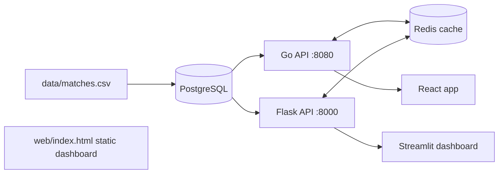

# NCAA Women's Soccer Analytics

Home-vs-away analytics for NCAA D1 women's soccer (Rice Owls, American Conference), with dual Go and Python REST APIs over a shared PostgreSQL schema, Redis caching, Docker packaging, and AWS ECS deployment scaffolding.

## Architecture


## Components
| Path | What it is |
|---|---|
| `go-api/` | Go `net/http` service: `/api/v2/matches`, `/api/v2/summary`, input validation, Redis read-through cache, request timeouts |
| `api/` | Flask service with the same data under `/api/*`, parameterized SQL, pytest suite |
| `db/schema.sql` | `matches` table with `CHECK` constraints, a unique key, and a composite `(season, venue)` index |
| `frontend/` | React (Vite) app: season picker, home/away cards, goal-difference chart, polling hook |
| `dashboard/` | Streamlit analyst view |
| `web/index.html` | Standalone dashboard: season selector, momentum, tactical-shape timeline, formation morph, player radar |
| `deploy/`, `.github/workflows/` | ECS task definition template, CI (pytest, go test, frontend build), ECR/ECS deploy workflow |

## Data
- **2024:** Wyscout team report (10 matches, plus formations and player stats shown in `web/`).
- **2025:** regular-season results (17 matches) from the American Conference schedule.
- **2026:** season to date, only matches with confirmed scores (7). Rows with unknown scores are intentionally omitted.
- Home/away comes from the schedule's "at" convention. Conference-tournament matches are excluded.

## Quick start
```bash
docker compose up --build
curl "localhost:8080/api/v2/summary?season=2025"
curl "localhost:8000/api/summary?season=2025&venue=away"
cd frontend && npm install && npm run dev        # React on :5173, proxies /api to :8080
pip install -r dashboard/requirements.txt && streamlit run dashboard/streamlit_app.py
```

## Tests
```bash
cd api && pip install -r requirements.txt -r requirements-dev.txt && pytest
cd go-api && go test ./...
```

## Deployment (AWS)
`deploy/ecs-task-def.json` is a Fargate task template (fill in the `<PLACEHOLDERS>`; database URL comes from Secrets Manager, Redis from ElastiCache). The `deploy` workflow builds and pushes both images to ECR; you still need to provision the VPC, RDS, ElastiCache, ECR repositories, ECS service and IAM role.

## Roadmap
Per-match xG and player-level ingestion for 2025-26, WebSocket streaming in place of polling, Terraform for the AWS stack.

## License
MIT
