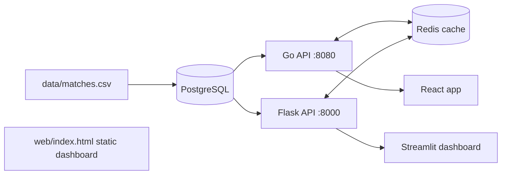

# NCAA Women's Soccer Analytics

Home-vs-away analytics for NCAA D1 women's soccer (Rice Owls, American Conference), with dual Go and Python REST APIs over a shared PostgreSQL schema, Redis caching, Docker packaging, and AWS ECS deployment scaffolding.

This project turns raw match data into clear, visual answers to the questions coaches ask every week. Is our team playing better at home or on the road? Are we gaining or losing momentum over the season? Which formations work, and when do we change shape? Which players create the most danger? Instead of making staff dig through spreadsheets and dense reports, the platform puts these answers on one interactive website that anyone can open and explore, with no technical background needed.

The aim is to make performance analysis easy to understand, fast to use, and useful in real decisions. Coaches can compare home and away results side by side, switch between seasons, and follow a team's trajectory game by game through a momentum chart that shows whether results are building or fading. Tactical views show which formation a team used in each stretch of every match. They also show how players shift position when the shape changes, and how individual players compare on scoring chances, passing, dribbling and defensive work. Plain-language insights sit beside the charts, so the numbers always come with an explanation of what they mean.

In practice, the results are a set of patterns that are easy to miss in raw statistics. They include gaps between home and away performance, stretches of form that build or fade, and formations that produce better or worse outcomes. The analysis also shows how much of a gap comes from opponent strength rather than venue, and which players contribute beyond the goals and assists listed in a box score. The platform was built and tested on real match data from a college women's soccer program, and every chart is generated from the underlying data rather than drawn by hand, so the same views update automatically whenever new games are added.

The project's biggest strength is that it is not tied to one team, one league or one sport's data source. The same structure works for any NCAA program, and equally for professional clubs, because every team's matches follow the same basic pattern of opponent, venue, score and tactical setup. Adding a new team or season means loading new data, not redesigning the system. Richer inputs, such as player tracking or advanced statistics from a data provider, make the tactical and player views deeper without changing how coaches use them. A college program could use it to scout opponents and review its own season. A professional club could use it to track form across a long schedule and compare lineups.

Under the hood, the platform is built with the reliability of professional software. It has a structured database that keeps match records clean and consistent, and a fast data service that stays responsive when many staff members use it at once. It also checks every request to prevent bad inputs, and it is packaged so it can run the same way on a laptop or in the cloud. Coaches and staff only see the result: a responsive website that works on a phone, a tablet or a laptop, loads quickly, and presents each question in a form that is easy to read at a glance, whether in a film session or on the sideline.

## Architecture


## Components
| Path | What it is |
|---|---|
| `go-api/` | Go `net/http` service: `/api/v2/matches`, `/api/v2/summary`, input validation, Redis read-through cache, request timeouts |
| `api/` | Flask service with the same data under `/api/*`, parameterized SQL, pytest suite |
| `db/schema.sql` | `matches` table with `CHECK` constraints, a unique key, and a composite `(season, venue)` index |
| `frontend/` | React (Vite) app: season picker, home/away cards, goal-difference chart, polling hook |
| `dashboard/` | Streamlit analyst view |
| `web/index.html` | Standalone dashboard: season selector, momentum, tactical-shape timeline, formation morph, player radar |
| `deploy/`, `.github/workflows/` | ECS task definition template, CI (pytest, go test, frontend build), ECR/ECS deploy workflow |

## Data
- **2024:** Wyscout team report (10 matches, plus formations and player stats shown in `web/`).
- **2025:** regular-season results (17 matches) from the American Conference schedule.
- **2026:** season to date, only matches with confirmed scores (7). Rows with unknown scores are intentionally omitted.
- Home/away comes from the schedule's "at" convention. Conference-tournament matches are excluded.

## Quick start
```bash
docker compose up --build
curl "localhost:8080/api/v2/summary?season=2025"
curl "localhost:8000/api/summary?season=2025&venue=away"
cd frontend && npm install && npm run dev        # React on :5173, proxies /api to :8080
pip install -r dashboard/requirements.txt && streamlit run dashboard/streamlit_app.py
```

## Tests
```bash
cd api && pip install -r requirements.txt -r requirements-dev.txt && pytest
cd go-api && go test ./...
```

## Deployment (AWS)
`deploy/ecs-task-def.json` is a Fargate task template (fill in the `<PLACEHOLDERS>`; database URL comes from Secrets Manager, Redis from ElastiCache). The `deploy` workflow builds and pushes both images to ECR; you still need to provision the VPC, RDS, ElastiCache, ECR repositories, ECS service and IAM role.

## Roadmap
Per-match xG and player-level ingestion for 2025-26, WebSocket streaming in place of polling, Terraform for the AWS stack.

## License
MIT
